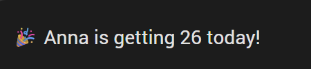
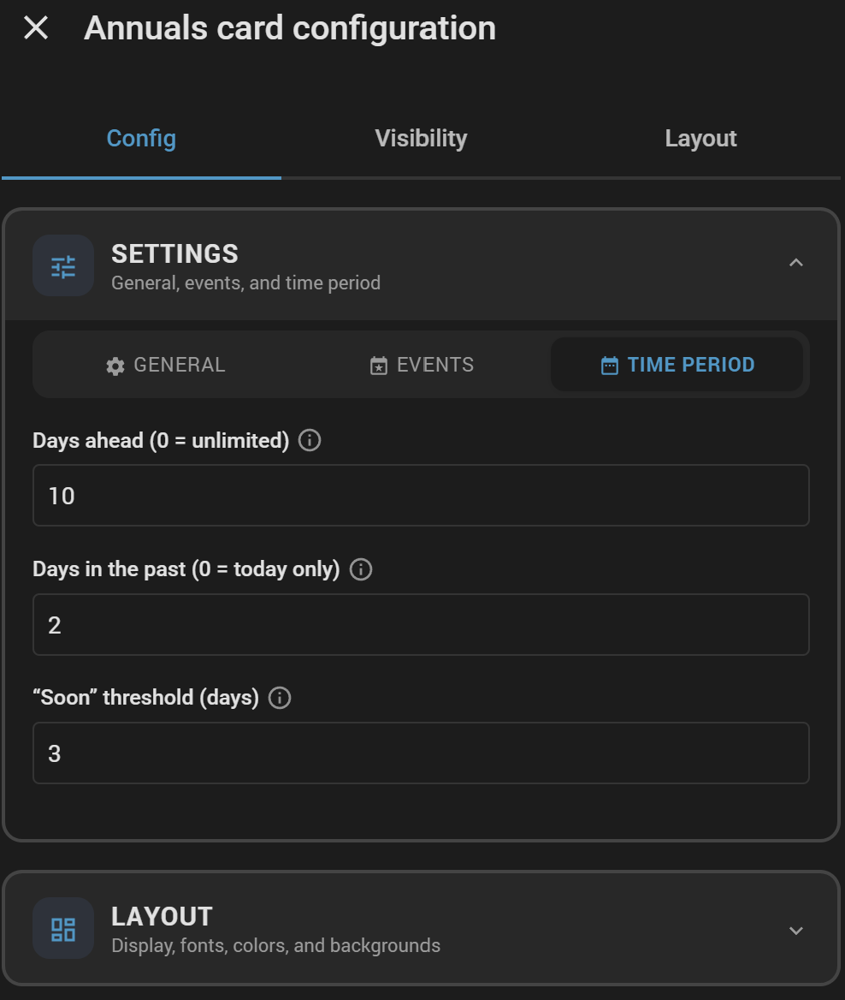
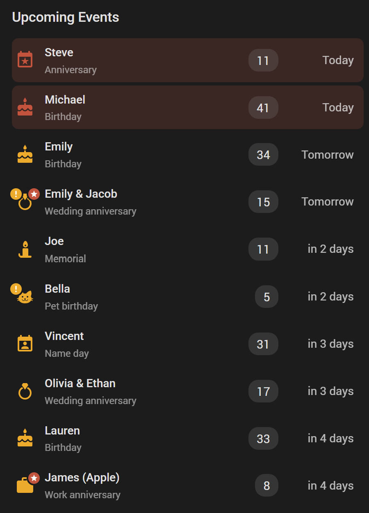
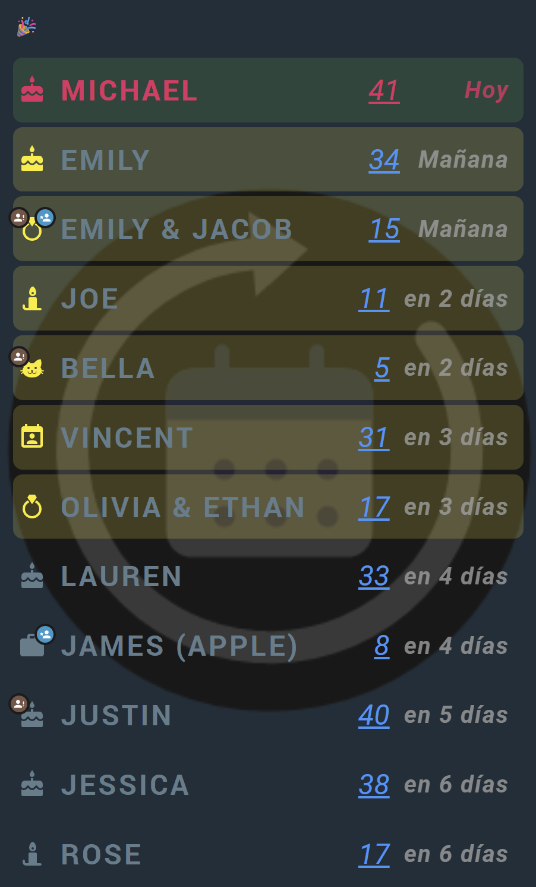

#  Annuals Integration for Home Assistant - more than birthdays only

[](https://github.com/somansch/annuals/releases/latest)
[](https://github.com/hacs/integration)
[](LICENSE)

**Available languages:** English, Deutsch, Français, Nederlands, Polski, Español, Italiano, Português (Brasil), Русский, Svenska, 简体中文, Čeština, Norsk bokmål, Dansk, Türkçe

## Overview

Keeping track of birthdays, anniversaries, and other yearly dates usually means either a separate app you have to remember to check, or a calendar entry that just says "Anna's birthday" without telling you it's her 30th this year. Annuals brings that into Home Assistant instead, so it can show up on your dashboard, feed your existing notification automations, and answer "how many days until X, and which one is it" without any manual bookkeeping each year.

Typical reasons to use it:
- **Never miss a birthday or anniversary again** - get a notification the morning of, or a heads-up a week before a milestone, using your existing notification setup (mobile app, Alexa, TTS, whatever you already have).
- **Know at a glance which occurrence it is** - "Anna turns 30" instead of just "Anna's birthday", computed automatically from the year you entered once.
- **Track more than birthdays** - name days, wedding anniversaries, memorials, pet birthdays, work anniversaries, or anything custom, each with its own icon and aggregate calendar.
- **Highlight the ones that matter most** - flag close family as **VIP** so they always stand out, and let round-number milestones (18th, 30th, 50th, ...) mark themselves as **Important** automatically, both on the bundled dashboard card and in your own automations.
- **Bring in a whole contact list at once** via CSV import, instead of adding entries one by one.

Annuals tracks yearly-recurring events - birthdays, anniversaries, name days, wedding anniversaries, memorials, or anything custom - and reports, for each one, how many days until its next occurrence and which occurrence number that will be (e.g. someone's 30th birthday).

**Architecture note:** each event is its own config entry, the same pattern Home Assistant uses for "helper"-style integrations (Generic Thermostat, Threshold, Derivative, ...). This means finding and editing a specific event later doesn't need a custom picker inside this integration - **Settings → Devices & Services** already has a search box, and clicking an entry's **Configure** opens that one event's form pre-filled, ready to edit.

## First-time setup

The first time you go to **Settings → Devices & Services → Add Integration → "Annuals"**, it sets up just the **"Annuals Settings" hub entry** and its shared calendars - no event form, nothing to fill in yet. Add your events afterwards, either one at a time or all at once from a CSV file (see below).

## Adding an event

**Settings → Devices & Services**, click the **"Annuals"** integration tile to open the list of existing entries, then **Add entry** - once per event. (You only go through **Add Integration** once, during first-time setup above; every event after that is added from within the "Annuals" tile.)

| Field | Description |
|---|---|
| **Name** | Whose event this is (e.g. "Anna"). Becomes the entry's title and the entity name. |
| **Event type** | One of the eight types below - each gets a matching icon and its own aggregate calendar. |
| **Day** / **Month** | The recurring date. Deliberately separate fields instead of a date picker - a picker would make you click back month by month to reach a birth year like 1970. |
| **Year** | Optional. Type it directly (one keystroke instead of a picker). Leave empty when unknown - the `occurrence_number` attribute is then hidden, since it can't be computed without a starting year. |
| **Icon override** | Optional. Home Assistant's native icon picker. Leave empty to use the type's default icon. |
| **VIP annual** | Optional, off by default. Marks this one event as VIP - independent of type or occurrence number, e.g. a close family member's birthday you always want to stand out. Purely a display flag: the [custom dashboard card](#custom-dashboard-card) below can filter to VIP-only and show a distinct badge. |

| Type | Default icon |
|---|---|
| Birthday | `mdi:cake-variant` |
| Anniversary | `mdi:calendar-star` |
| Name day | `mdi:calendar-account` |
| Wedding anniversary | `mdi:ring` |
| Memorial | `mdi:candle` |
| Pet birthday | `mdi:paw` |
| Work anniversary | `mdi:briefcase` |
| Custom | `mdi:calendar-heart` |

To edit or remove an event afterwards, find its entry under **Settings → Devices & Services → Annuals**, and use **Configure** (edit) or the "⋮" menu (delete).

### Leap years

The integration accounts for leap years (February 29) when calculating the number of days until the next anniversary.

If your birthday is on February 29th it is calculated correctly, and it does not fall back to March 1st — instead, in non-leap years it falls back to February 28th.

Concretely:
- Leap year (e.g. 2028): the event falls exactly on February 29th.
- Non-leap year (2025, 2026, 2027, 2029, …): the event falls on February 28th.

This is a deliberate design choice: it guarantees an occurrence every year (not just once every four years), and `occurrence_number` (e.g. "turning 30") still counts correctly, since it's simply computed as target year - birth year, independent of the exact day.

## Important annual (automatic milestones)

Beyond the manual VIP flag, Annuals can automatically mark an event as **Important** based on its upcoming occurrence number - e.g. a 18th, 30th, or 50th birthday, or a 25th wedding anniversary. This is computed per event type from a list of milestone occurrence numbers, editable under **Settings → Devices & Services → Annuals → "Annuals Settings" hub entry → Configure → Annual Settings**.

Each event type gets its own comma-separated list of occurrence numbers (e.g. `18,21,30,40,50,60,65,70,75,80,85,90,95,100` for birthdays) that come pre-filled with sensible cultural defaults - round numbers plus the traditional "special" birthdays, 5-year steps for work anniversaries, and so on. Edit a field to change its milestones, or clear it entirely to disable "Important" detection for that type. Name day and Custom events have no cultural convention, so they default to empty (never automatically "Important") unless you set your own list.

Both `vip` and `important` are exposed as sensor attributes (see [Created entities](#created-entities) below) and both feed into the [custom dashboard card](#custom-dashboard-card)'s filters and badges - VIP is a manual, permanent flag on one event; Important is automatic and only true in the specific year a milestone is reached.

## Importing events from a CSV file

Find the **"Annuals Settings" hub entry** under **Settings → Devices & Services → Annuals** and click **Configure** - this opens a menu with "Import events from CSV". Import is useful for bringing in a whole contact list at once instead of adding events one by one.

The file needs a header row with these columns:

| Column | Required | Description |
|---|---|---|
| `name` | Yes | Whose event this is. |
| `type` | Yes | One of the internal English keys, not case-sensitive: `birthday`, `anniversary`, `name_day`, `wedding_anniversary`, `memorial`, `pet_birthday`, `work_anniversary`, `custom`. Always English, regardless of your language setting - translated labels aren't accepted here. |
| `day`, `month` | Yes | The recurring date. |
| `year` | No | Leave empty if unknown. |
| `icon` | No | An MDI icon name (e.g. `mdi:cake-variant`) to override the type's default. |
| `vip` | No | Accepts `1`/`true`/`yes`/`y`/`x` (case-insensitive) to mark the event VIP. Leave empty or omit the column otherwise. |

Keep every column even when a value is empty - a row with a missing trailing comma shifts the following values left.

```csv
name,type,day,month,year,icon,vip
Anna,birthday,12,4,1988,,
Max,pet_birthday,3,9,2020,mdi:dog,
Acme Corp,work_anniversary,1,7,2015,,
Test Custom,custom,1,1,,mdi:test-tube,1
```

### Deleting everything

**"Annuals Settings" hub entry → Configure → Delete all Annuals data.** Permanently removes every event entry, the shared calendars, and the hub itself - the entire integration and everything it created. Requires confirming a warning screen before anything is deleted; this cannot be undone.

## Created entities

Each event you add is its own config entry, titled `<Type>: <Name>` (e.g. "Birthday: Anna") so the integration page groups and searches by type. The single **"Annuals Settings" hub entry**, created during first-time setup, owns the shared per-type calendars (and any future cross-event entities). It has no event fields of its own beyond the CSV import and delete-all tools above; don't delete it manually unless you're removing the whole integration.

| Entity | Description |
|---|---|
| `sensor.annuals_<type>_<name>` | One per event. State is the number of days until its next occurrence; the display name is the translated, type-prefixed event name (e.g. "Birthday Anna"). The `<type>` in the entity_id keeps two events sharing a name (e.g. a birthday and a wedding anniversary) from colliding, and applies to every type including "Custom". |
| `calendar.annuals_<type>` | One per event *type* (eight total), named in the plural (e.g. "Birthdays"), aggregating every event of that type across all your entries - open it from the built-in Calendar dashboard. |

Attributes on each event's sensor:

| Attribute | Description |
|---|---|
| `state` | Days until the next occurrence. |
| `type` | One of `birthday`, `anniversary`, `name_day`, `wedding_anniversary`, `memorial`, `pet_birthday`, `work_anniversary`, `custom`. |
| `name` | The plain name as entered (e.g. "Anna"), without the type prefix baked into the entity's display name - handy for building sentences on a dashboard. |
| `next_date` | Date (ISO format) of the next occurrence. |
| `occurrence_number` | Which occurrence the next date will be (e.g. `30` for a 30th birthday) - `null` when no year was entered. |
| `day`, `month`, `year` | The event's date as entered (`year` is `null` when unknown). |
| `vip` | `true` if the **VIP annual** flag is set on this event, `false` otherwise. |
| `important` | `true` if the upcoming occurrence number matches one of that type's milestones in [Annual Settings](#important-annual-automatic-milestones), `false` otherwise (always `false` when no year was entered, since there's no occurrence number to check). |

Attributes on each per-type calendar (standard Home Assistant calendar entity attributes, reflecting whichever event is current or comes up next for that type):

| Attribute | Description |
|---|---|
| `state` | `on` when today falls within one of this type's events (an all-day event, so this is `on` for the whole day), `off` otherwise. |
| `message` | The event summary shown in the calendar, e.g. "Anna - Birthday (26)" (just "Anna" for Custom events, since restating "Custom" would be redundant). |
| `all_day` | Always `true` - events are stored as whole days, not specific times. |
| `start_time`, `end_time` | The event's date, formatted as `YYYY-MM-DD HH:MM:SS` (start at midnight, end the next midnight). |
| `location`, `description` | Always empty - not currently populated. |

## Automation examples

Since `vip` and `important` are plain sensor attributes, they're just as usable in your own automations as on the dashboard card. Both examples below use a daily **time trigger** plus a `repeat: for_each` action, rather than a `state` trigger on one specific entity - that way they keep working as-is no matter how many events you add or remove later, without listing every `sensor.annuals_*` entity by hand. Replace `notify.notify` with your own notify target (e.g. `notify.mobile_app_your_phone`).

**Notify me when a VIP has their day today:**

```yaml
automation:
  - alias: "Annuals - VIP event today"
    triggers:
      - trigger: time
        at: "08:00:00"
    actions:
      - repeat:
          for_each: >
            {{ states.sensor
               | selectattr('entity_id', 'match', '^sensor\.annuals_')
               | selectattr('attributes.vip', 'equalto', true)
               | selectattr('state', 'equalto', '0')
               | map(attribute='entity_id')
               | list }}
          sequence:
            - action: notify.notify
              data:
                message: >
                  {{ state_attr(repeat.item, 'name') }} has their event today!
```

**Remind me 7 days before an important milestone:**

```yaml
automation:
  - alias: "Annuals - important milestone in 7 days"
    triggers:
      - trigger: time
        at: "08:00:00"
    actions:
      - repeat:
          for_each: >
            {{ states.sensor
               | selectattr('entity_id', 'match', '^sensor\.annuals_')
               | selectattr('attributes.important', 'equalto', true)
               | selectattr('state', 'equalto', '7')
               | map(attribute='entity_id')
               | list }}
          sequence:
            - action: notify.notify
              data:
                message: >
                  {{ state_attr(repeat.item, 'name') }}'s {{ state_attr(repeat.item, 'occurrence_number') }}. event is in 7 days!
```

Adjust the `"7"` in the second example to match however far ahead you want the reminder, and add a second `repeat` block (or duplicate the automation) if you want more than one lead time.

## Dashboard examples with HA built-in cards

### Next event only


A one-line, type-aware sentence using the sensor's `name` attribute (see the attribute table above) - adjust the wording to your language:

```yaml
type: markdown
content: >
  
  
    
  
  
  
  
  
  
  ## <ha-icon icon="{{ e.attributes.icon }}"></ha-icon> Next up

  
  {{ name }} has their birthday {{ when }} and turns {{ n }}.
  
  {{ name }}'s {{ n }}. wedding anniversary is {{ when }}.
  
  {{ name }} celebrates their {{ n }}. work anniversary {{ when }}.
  
  {{ name }}'s event is {{ when }} ({{ n }}. time).
  
  {{ name }}'s event is {{ when }}.
  
  
  No events yet.
  
```

For German phrasing (example: "Hans hat in 3 Tagen Geburtstag und wird 40 Jahre alt"), swap the birthday line for `{{ name }} hat {{ when }} Geburtstag und wird {{ n }} Jahre alt.` and translate `No events yet.`/`Keine Ereignisse.` accordingly.

### Today's birthday only



Each `calendar.annuals_<type>` entity's `state` is simply `on` whenever one of its events falls today (`off` otherwise) - a **Conditional card** wrapping the Markdown card uses that directly, so the card only appears on the day itself instead of always showing (and being empty or irrelevant) the rest of the year:

```yaml
type: conditional
conditions:
  - condition: state
    entity: calendar.annuals_birthday
    state: "on"
card:
  type: markdown
  content: >
    
    
    
    🎉 {{ name }} is getting {{ age }} today!
```

This parses the calendar event's `message` attribute (e.g. "Anna - Birthday (26)") since the calendar entity itself doesn't carry a separate age/name attribute the way the sensor does. If two birthdays land on the same day, only one shows - the calendar only ever reports its single next/current event, same limitation as the "next event" card above.

The same `on`/`off` state is just as useful for automations - for example, a state trigger on `calendar.annuals_birthday` (`to: "on"`) to fire a notification the moment a birthday starts, without any template or scheduling logic of your own.

### Native Calendar card


Add a **Calendar card** pointed at one or more of the `calendar.annuals_<type>` entities for a native calendar view:


## Custom dashboard card

Annuals bundles its own Lovelace card (`custom:annuals-card`) - no separate frontend package to install via HACS, it ships with the integration and registers itself automatically. Add it to a dashboard the normal way (search for "Annuals Card" in the card picker) and configure it entirely through its visual editor, no YAML required: which event categories to show, the time window, VIP/Important filters, per-field colors and fonts, highlight tinting for past/today/soon rows, and an optional card background image or color.

The card's own UI text (not the integration's entities/config-flow, which follow your server's language setting) follows **your personal profile language** - Settings → People → your user → Language - and is available in the same 15 languages as the rest of the integration.

### The visual editor



The editor is split into two tabs - **Settings** (general settings, which event types to include, and the days-ahead/days-past/soon-threshold time window) and **Layout** (show/hide individual row elements, apply the VIP-only/Important-only filters, fonts, colors, highlight tinting, and card background) - each further grouped into collapsible sections so the form stays manageable even with this many options.

### Example configurations

A plain, unstyled card - just the defaults, letting the row highlighting (today/soon) and your Home Assistant theme do the work:



```yaml
type: custom:annuals-card
title: ""
show_title: true
count: 10
days_ahead: 0
days_past: 0
soon_days: 7
types: []
show_past: true
show_today: true
show_soon: true
highlight_past: true
highlight_today: true
highlight_soon: false
show_icon: true
show_name: true
show_subtitle: true
show_badge: true
show_when: true
show_vip_badge: true
show_important_badge: true
vip_badge_icon: mdi:star
important_badge_icon: mdi:exclamation-thick
```

A fully styled card - custom colors per row element, bold/uppercase/underlined fonts, highlight tints for past/today/soon, custom VIP/Important badge icons and colors, and a translucent background image:



```yaml
type: custom:annuals-card
title: 🎉
show_title: true
count: 12
days_ahead: 10
days_past: 2
soon_days: 3
types:
  - birthday
  - name_day
  - wedding_anniversary
  - memorial
  - pet_birthday
  - work_anniversary
  - custom
show_past: true
show_today: true
show_soon: true
highlight_past: true
highlight_today: true
highlight_soon: true
show_icon: true
show_name: true
show_subtitle: false
show_badge: true
show_when: true
show_vip_badge: true
show_important_badge: true
vip_badge_icon: mdi:account-star
important_badge_icon: mdi:account-alert
colors:
  today: "#e91e63"
  soon: "#ffeb3b"
  accent: "#607d8b"
  title: "#607d8b"
  badge: "#2196f3"
  when: "#9e9e9e"
  match_today: true
  highlight_past: "#9c27b0"
  highlight_today: "#4caf50"
  highlight_soon: "#ffeb3b"
  vip_badge: var(--primary-color)
  important_badge: "#795548"
font_sizes:
  title: 24px
  badge: 24px
  when: 20px
font_style:
  title:
    bold: true
    uppercase: true
    letter_spacing: 2px
  subtitle:
    italic: true
  badge:
    italic: true
    underline: true
  when:
    bold: true
    italic: true
    letter_spacing: 1px
background:
  enabled: true
  color: "#03a9f4"
  image: /local/your-image.jpg
  size: contain
  opacity: 13
```

Both are set through the visual editor above - shown here as YAML just to make the full option set easy to scan and copy. Every field left at its default (`""`, `false`, or omitted) in these examples inherits from your Home Assistant theme, per the CSS variables below.

### Theming with CSS variables

Every color, font size, and font style set in the card's editor is also exposed as a CSS custom property, with a fallback chain down to Home Assistant's own theme variables. This means:

- Leaving a color/font field **empty** in the card's own editor lets it inherit from your **theme** (or any custom CSS) instead of a hardcoded value.
- Setting a value in the card's editor always overrides the theme for that one card, same as any other per-card setting.

To theme every Annuals card at once, add these under a theme's `styles` (or set them globally via `card-mod`/custom CSS targeting `annuals-card`):

| Variable | Affects | Falls back to |
| --- | --- | --- |
| `--annuals-accent-color` | Icon color for events with no special status | `--primary-text-color` |
| `--annuals-today-color` | Icon color for today's events | `--error-color` |
| `--annuals-soon-color` | Icon color for events within the "soon" threshold | `--warning-color` |
| `--annuals-title-color` | Event name text color | inherit |
| `--annuals-subtitle-color` | Event type text color | inherit |
| `--annuals-badge-color` | Occurrence number badge text color | inherit |
| `--annuals-badge-bg-color` | Occurrence number badge background color | `rgba(128, 128, 128, 0.25)` |
| `--annuals-when-color` | Countdown text color | inherit |
| `--annuals-highlight-past-color` | Row tint for past events | `--secondary-text-color` |
| `--annuals-highlight-today-color` | Row tint for today's events | `--annuals-today-color` |
| `--annuals-highlight-soon-color` | Row tint for "soon" events | `--annuals-soon-color` |
| `--annuals-vip-badge-color` | VIP badge background color | `--error-color` |
| `--annuals-important-badge-color` | Important badge background color | `--annuals-soon-color` |
| `--annuals-title-size` | Card title font size | `1.2em` |
| `--annuals-row-title-size` / `-row-subtitle-size` / `-row-badge-size` / `-row-when-size` | Per-field row font sizes | inherit |
| `--annuals-title-weight` / `-style` / `-transform` / `-decoration` / `-spacing` | Card title bold/italic/uppercase/underline/letter-spacing | normal |
| `--annuals-row-title-weight` / `-row-subtitle-weight` / `-row-badge-weight` / `-row-when-weight` (+ matching `-style`/`-transform`/`-decoration`/`-spacing`) | Same style options per row field | normal |
| `--annuals-bg-color` / `-bg-image` / `-bg-size` / `-bg-repeat` / `-bg-opacity` | Card background color/image/behavior/opacity | transparent / none |


## Installation

### HACS (recommended)

1. Install HACS if you don't have it already
2. Open HACS in Home Assistant
3. Click on the 3 dots in the top right corner
4. Select "Custom repositories"
5. Add the following URL to the repository: `https://github.com/somansch/annuals`
6. Select "Integration" as category
7. Click the "ADD" button
8. Search for "Annuals"
9. Click the "Download" button
10. Restart HA

### Manual

Download `annuals.zip` from the [latest release](https://github.com/somansch/annuals/releases/latest) and extract its contents to the `config/custom_components/annuals` directory:

```bash
mkdir -p custom_components/annuals
cd custom_components/annuals
wget https://github.com/somansch/annuals/releases/latest/download/annuals.zip
unzip annuals.zip
rm annuals.zip
```

The [custom dashboard card](#custom-dashboard-card) works identically either way - it's part of the same `annuals.zip`/`custom_components/annuals` tree, and the integration registers and serves it itself on every startup, so a manual install needs no separate Lovelace resource step, same as HACS.

## Help and Contribution

If you find a problem, feel free to open an issue and I will do my best to help. If you have something to contribute, your help is greatly appreciated! If you want to add a new feature, please open a pull request first so we can discuss the details.

---

[](https://www.buymeacoffee.com/somansch)
