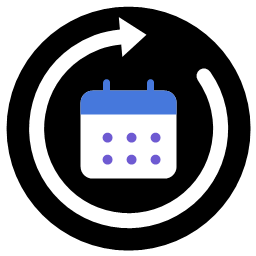
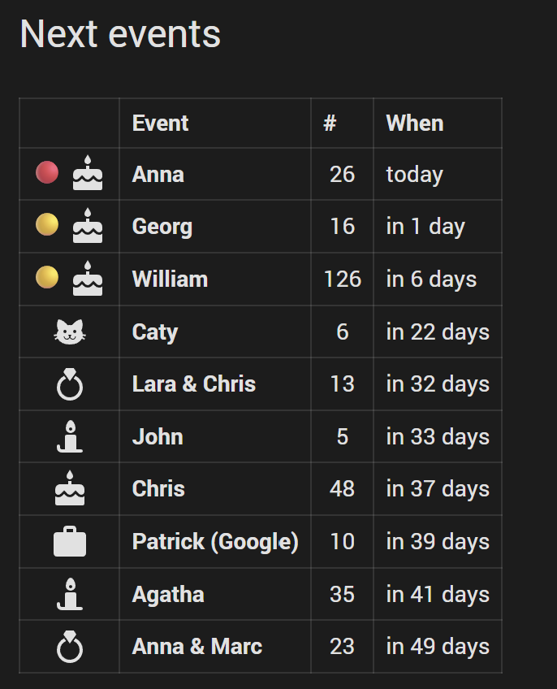
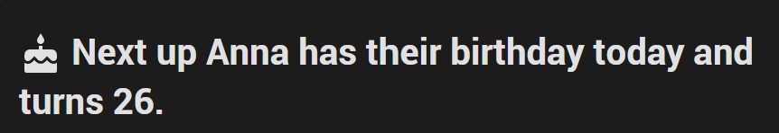
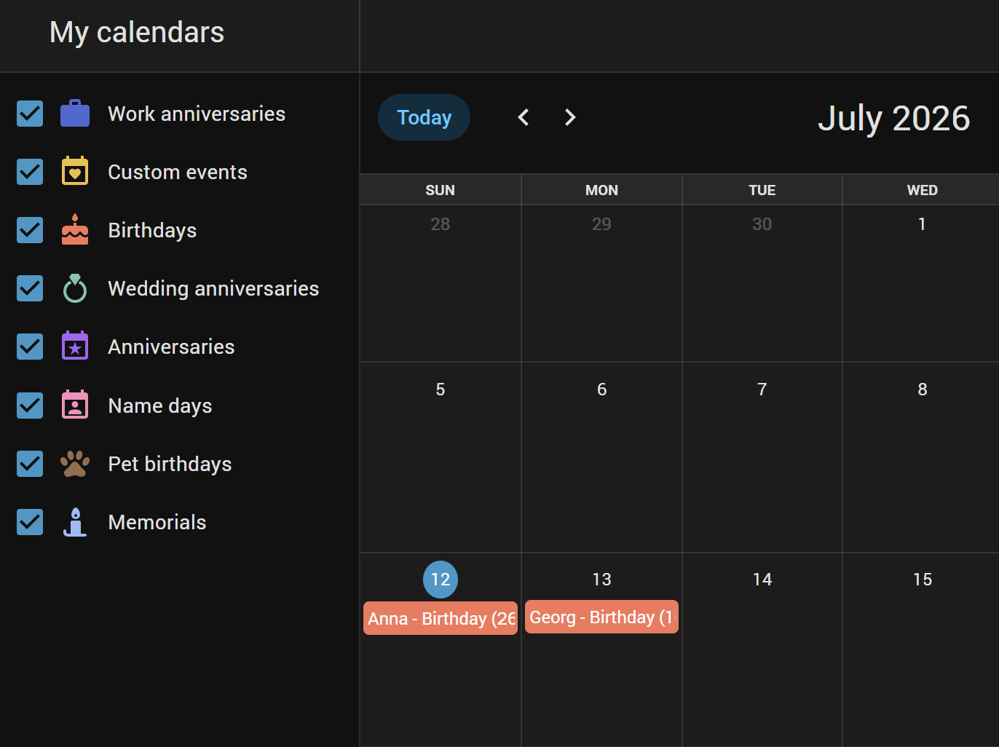
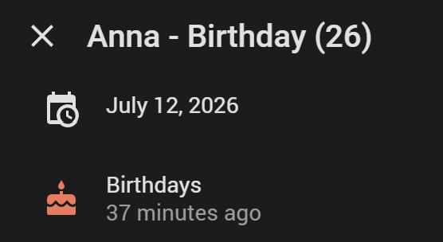

[](https://www.buymeacoffee.com/somansch)

#  Annuals Integration for Home Assistant - more than birthdays only

[](https://github.com/somansch/annuals/releases/latest)
[](https://github.com/hacs/integration)
[](LICENSE)

**Available languages:** English, Deutsch, Français, Nederlands, Polski, Español, Italiano, Português (Brasil), Русский, Svenska, 简体中文, Čeština, Norsk bokmål, Dansk, Türkçe

## Overview

Annuals tracks yearly-recurring events - birthdays, anniversaries, name days, wedding anniversaries, memorials, or anything custom - and reports, for each one, how many days until its next occurrence and which occurrence number that will be (e.g. someone's 30th birthday).

**Architecture note:** each event is its own config entry, the same pattern Home Assistant uses for "helper"-style integrations (Generic Thermostat, Threshold, Derivative, ...). This means finding and editing a specific event later doesn't need a custom picker inside this integration - **Settings → Devices & Services** already has a search box, and clicking an entry's **Configure** opens that one event's form pre-filled, ready to edit.

## First-time setup

The first time you go to **Settings → Devices & Services → Add Integration → "Annuals"**, it sets up just the **"Annuals Settings" hub entry** and its shared calendars - no event form, nothing to fill in yet. Add your events afterwards, either one at a time or all at once from a CSV file (see below).

## Adding an event

**Settings → Devices & Services**, click the **"Annuals"** integration tile to open the list of existing entries, then **Add entry** - once per event. (You only go through **Add Integration** once, during first-time setup above; every event after that is added from within the "Annuals" tile.)

| Field | Description |
|---|---|
| **Name** | Whose event this is (e.g. "Anna"). Becomes the entry's title and the entity name. |
| **Event type** | One of the eight types below - each gets a matching icon and its own aggregate calendar. |
| **Day** / **Month** | The recurring date. Deliberately separate fields instead of a date picker - a picker would make you click back month by month to reach a birth year like 1970. |
| **Year** | Optional. Type it directly (one keystroke instead of a picker). Leave empty when unknown - the `occurrence_number` attribute is then hidden, since it can't be computed without a starting year. |
| **Icon override** | Optional. Home Assistant's native icon picker. Leave empty to use the type's default icon. |

| Type | Default icon |
|---|---|
| Birthday | `mdi:cake-variant` |
| Anniversary | `mdi:calendar-star` |
| Name day | `mdi:calendar-account` |
| Wedding anniversary | `mdi:ring` |
| Memorial | `mdi:candle` |
| Pet birthday | `mdi:paw` |
| Work anniversary | `mdi:briefcase` |
| Custom | `mdi:calendar-heart` |

To edit or remove an event afterwards, find its entry under **Settings → Devices & Services → Annuals**, and use **Configure** (edit) or the "⋮" menu (delete).

## Importing events from a CSV file

Find the **"Annuals Settings" hub entry** under **Settings → Devices & Services → Annuals** and click **Configure** - this opens a menu with "Import events from CSV" and "Delete all Annuals data". Import is useful for bringing in a whole contact list at once instead of adding events one by one.

The file needs a header row with these columns:

| Column | Required | Description |
|---|---|---|
| `name` | Yes | Whose event this is. |
| `type` | Yes | One of the internal English keys, not case-sensitive: `birthday`, `anniversary`, `name_day`, `wedding_anniversary`, `memorial`, `pet_birthday`, `work_anniversary`, `custom`. Always English, regardless of your language setting - translated labels aren't accepted here. |
| `day`, `month` | Yes | The recurring date. |
| `year` | No | Leave empty if unknown. |
| `icon` | No | An MDI icon name (e.g. `mdi:cake-variant`) to override the type's default. |

```csv
name,type,day,month,year,icon
Anna,birthday,12,4,1988,
Max,pet_birthday,3,9,2020,mdi:dog
Acme Corp,work_anniversary,1,7,2015,
Test Custom,custom,1,1,,mdi:test-tube
```

### Deleting everything

**"Annuals Settings" hub entry → Configure → Delete all Annuals data.** Permanently removes every event entry, the shared calendars, and the hub itself - the entire integration and everything it created. Requires confirming a warning screen before anything is deleted; this cannot be undone.

## Created entities

Each event you add is its own config entry, titled `<Type>: <Name>` (e.g. "Birthday: Anna") so the integration page groups and searches by type. The single **"Annuals Settings" hub entry**, created during first-time setup, owns the shared per-type calendars (and any future cross-event entities). It has no event fields of its own beyond the CSV import and delete-all tools above; don't delete it manually unless you're removing the whole integration.

| Entity | Description |
|---|---|
| `sensor.annuals_<type>_<name>` | One per event. State is the number of days until its next occurrence; the display name is the translated, type-prefixed event name (e.g. "Birthday Anna"). The `<type>` in the entity_id keeps two events sharing a name (e.g. a birthday and a wedding anniversary) from colliding, and applies to every type including "Custom". |
| `calendar.annuals_<type>` | One per event *type* (eight total), named in the plural (e.g. "Birthdays"), aggregating every event of that type across all your entries - open it from the built-in Calendar dashboard. |

Attributes on each event's sensor:

| Attribute | Description |
|---|---|
| `state` | Days until the next occurrence. |
| `type` | One of `birthday`, `anniversary`, `name_day`, `wedding_anniversary`, `memorial`, `pet_birthday`, `work_anniversary`, `custom`. |
| `name` | The plain name as entered (e.g. "Anna"), without the type prefix baked into the entity's display name - handy for building sentences on a dashboard. |
| `next_date` | Date (ISO format) of the next occurrence. |
| `occurrence_number` | Which occurrence the next date will be (e.g. `30` for a 30th birthday) - `null` when no year was entered. |
| `day`, `month`, `year` | The event's date as entered (`year` is `null` when unknown). |

## Dashboard examples

There are already countless dashboard cards out there for this kind of thing, many of them prettier than what follows. The two examples below just show what's achievable with Home Assistant's own built-in **Markdown card** and no extra frontend cards to install - ready to paste into a dashboard's YAML editor as-is. If there's demand for a nicer, dedicated card, that's something that could go on the roadmap.

Both sort events by days remaining numerically (a plain string sort would put "10" before "2").

### Next 10 events

```yaml
type: markdown
title: Next events
content: |
  
  
    
  
  | | Event | # | When |
  | :---: | --- | :---: | --- |
  
  
  
  | {{ mark }} <ha-icon icon="{{ e.attributes.icon }}"></ha-icon> | **{{ e.attributes.name }}** | {{ n if n is not none else '–' }} | {{ 'today' if days == 0 else ('in 1 day' if days == 1 else 'in ' ~ days ~ ' days') }} |
  
```



### Next event only

A one-line, type-aware sentence using the sensor's `name` attribute (see the attribute table above) - adjust the wording to your language:

```yaml
type: markdown
content: >
  
  
    
  
  
  
  
  
  
  ## <ha-icon icon="{{ e.attributes.icon }}"></ha-icon> Next up

  
  {{ name }} has their birthday {{ when }} and turns {{ n }}.
  
  {{ name }}'s {{ n }}. wedding anniversary is {{ when }}.
  
  {{ name }} celebrates their {{ n }}. work anniversary {{ when }}.
  
  {{ name }}'s event is {{ when }} ({{ n }}. time).
  
  {{ name }}'s event is {{ when }}.
  
  
  No events yet.
  
```

For German phrasing (example: "Hans hat in 3 Tagen Geburtstag und wird 40 Jahre alt"), swap the birthday line for `{{ name }} hat {{ when }} Geburtstag und wird {{ n }} Jahre alt.` and translate `No events yet.`/`Keine Ereignisse.` accordingly.



Or, more simply, add a **Calendar card** pointed at one or more of the `calendar.annuals_<type>` entities for a native calendar view:





## Installation

### HACS (recommended)

1. Install HACS if you don't have it already
2. Open HACS in Home Assistant
3. Go to any of the sections (integrations, frontend, automation)
4. Click on the 3 dots in the top right corner
5. Select "Custom repositories"
6. Add the following URL to the repository: `https://github.com/somansch/annuals`
7. Select "Integration" as category
8. Click the "ADD" button
9. Search for "Annuals"
10. Click the "Download" button

### Manual

Download `annuals.zip` from the [latest release](https://github.com/somansch/annuals/releases/latest) and extract its contents to the `config/custom_components/annuals` directory:

```bash
mkdir -p custom_components/annuals
cd custom_components/annuals
wget https://github.com/somansch/annuals/releases/latest/download/annuals.zip
unzip annuals.zip
rm annuals.zip
```

## Help and Contribution

If you find a problem, feel free to open an issue and I will do my best to help. If you have something to contribute, your help is greatly appreciated! If you want to add a new feature, please open a pull request first so we can discuss the details.
