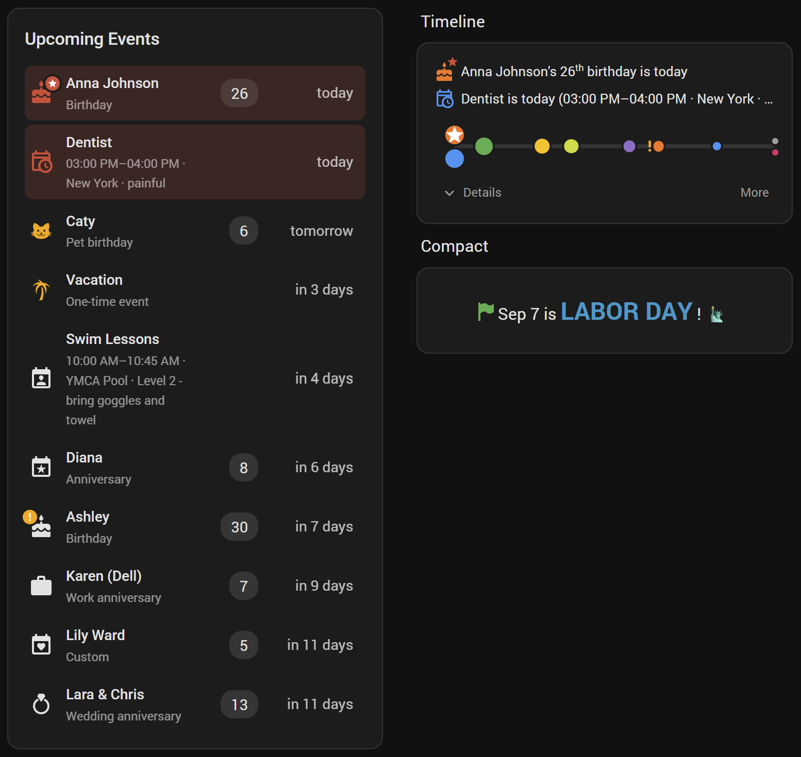
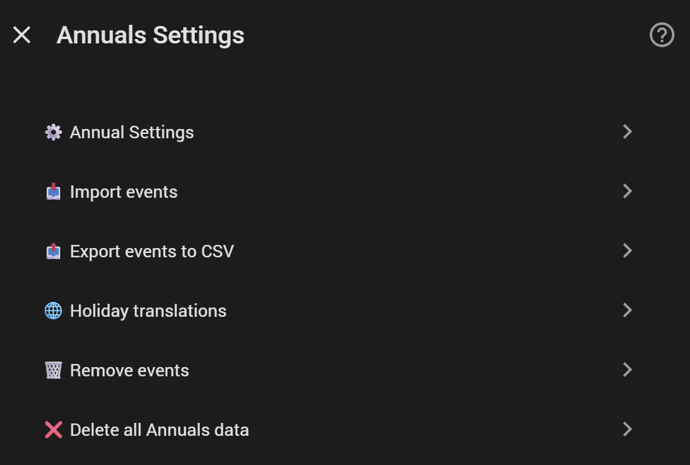
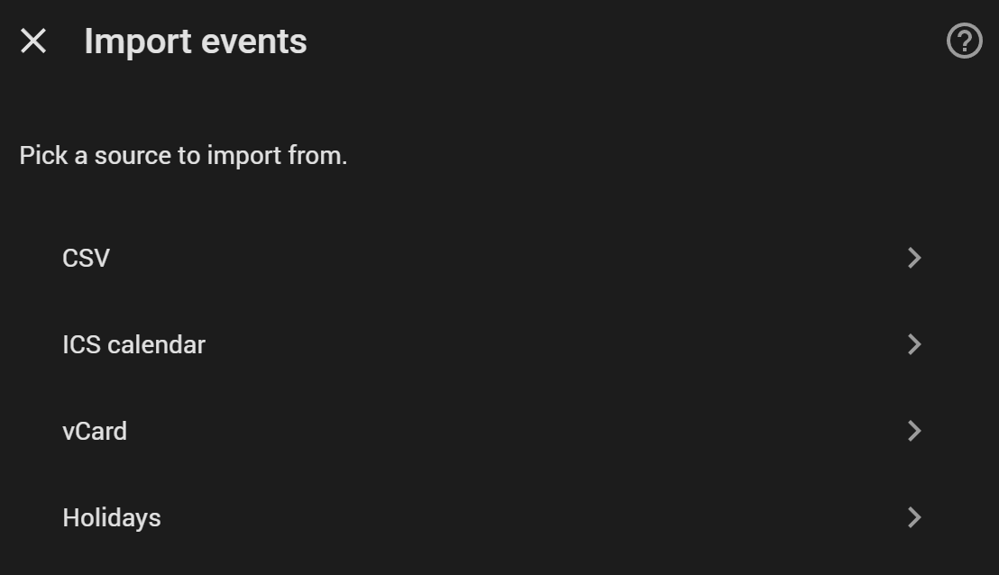
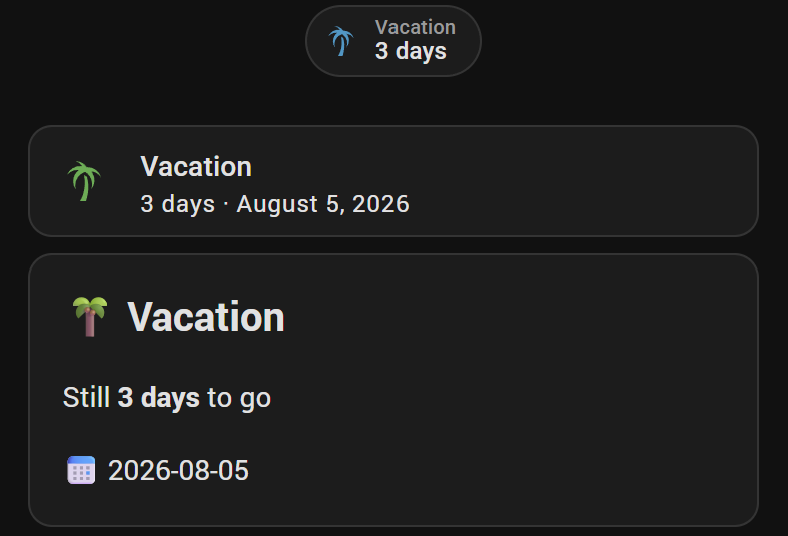
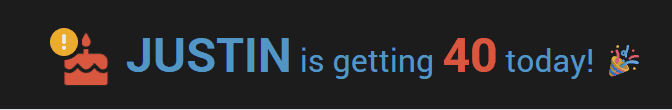
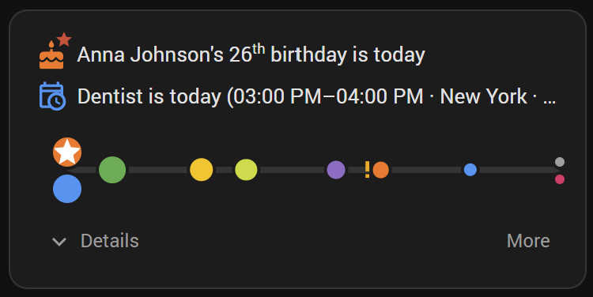
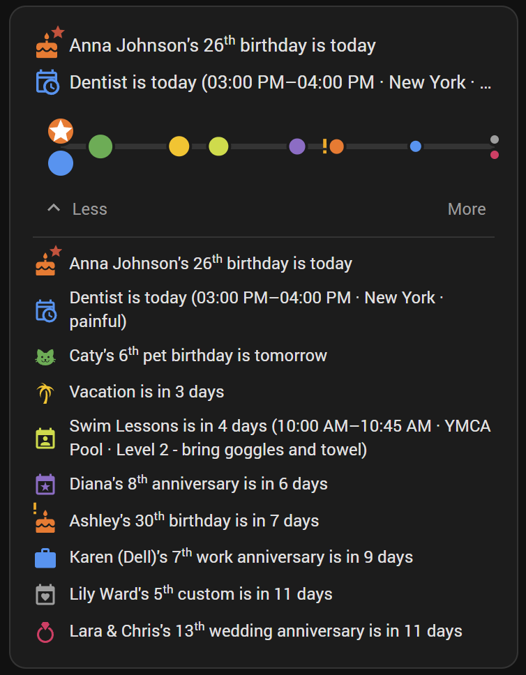
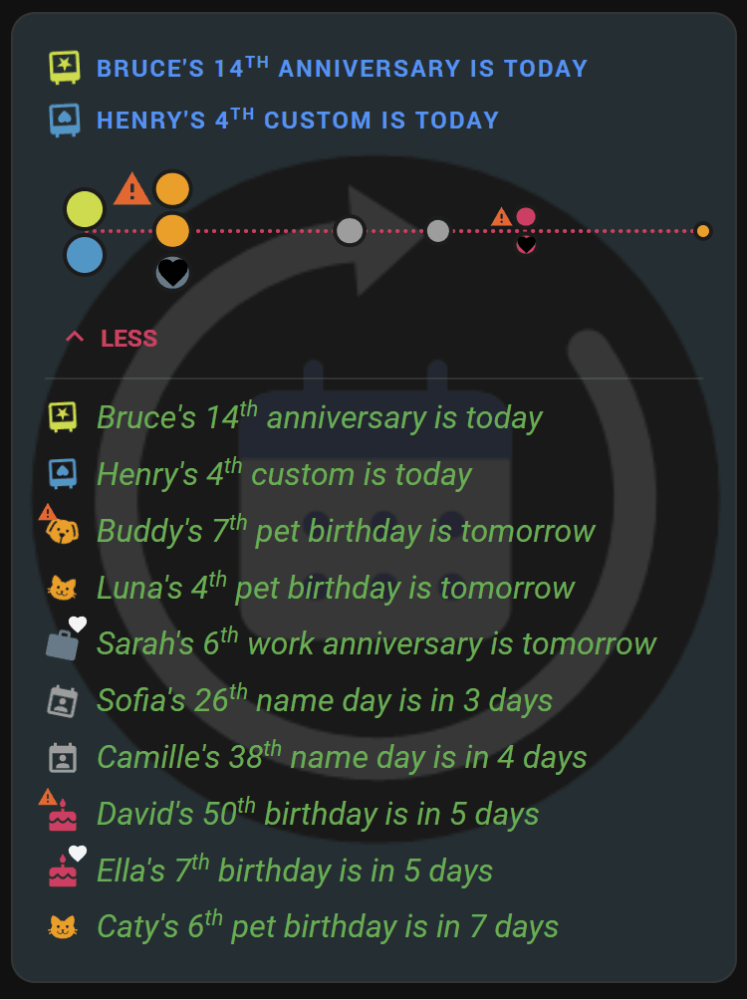

#  Annuals Integration for Home Assistant - more than birthdays/holidays only

[](https://github.com/somansch/annuals/releases/latest)
[](https://github.com/hacs/default)
[](LICENSE)

**Available languages:** English, Deutsch, Français, Nederlands, Polski, Español, Italiano, Português (Brasil), Русский, Svenska, 简体中文, Čeština, Norsk bokmål, Dansk, Türkçe



## Overview

Keeping track of birthdays, holidays, anniversaries, and other yearly dates usually means either a separate app you have to remember to check, or a calendar entry that just says "Anna's birthday" without telling you it's her 30th this year. Annuals brings that into Home Assistant instead, so it can show up on your dashboard, feed your existing notification automations, and answer "how many days until X, and which one is it" without any manual bookkeeping each year.

Typical reasons to use it:
- **Never miss a birthday or anniversary again** - get a notification the morning of, or a heads-up a week before a milestone, using your existing notification setup (mobile app, Alexa, TTS, whatever you already have).
- **Know at a glance which occurrence it is** - "Anna turns 30" instead of just "Anna's birthday", computed automatically from the year you entered once.
- **Track more than birthdays** - holidays, name days, wedding anniversaries, memorials, pet birthdays, work anniversaries, or anything custom, each with its own icon and aggregate calendar.
- **Import a whole country's public holidays** in a few clicks, categorized (public, bank, school breaks, religious, ...).
- **Highlight the ones that matter most** - flag close family as **VIP** so they always stand out, and let round-number milestones (18th, 30th, 50th, ...) mark themselves as **Important** automatically, both on the bundled dashboard card and in your own automations.
- **Bring in a whole contact list at once** via CSV, ICS calendar, or vCard import, instead of adding entries one by one.
- **Count down to a single dated thing that won't recur** - a booked vacation, an appointment, a delivery date - with a **one-time event**, which cleans itself up automatically the day after it passes.
- **See everything in one place** - embed your existing Home Assistant calendars (Google, CalDAV, Local Calendar, ...) alongside Annuals' own events in the same dashboard card, as a row list, a compact one-line sentence, or a horizontal timeline.

Annuals tracks yearly-recurring events - birthdays, holidays, anniversaries, name days, wedding anniversaries, memorials, or anything custom - and reports, for each one, how many days until its next occurrence and which occurrence number that will be (e.g. someone's 30th birthday).

**Architecture note:** each event is its own config entry, the same pattern Home Assistant uses for "helper"-style integrations (Generic Thermostat, Threshold, Derivative, ...). This means finding and editing a specific event later doesn't need a custom picker inside this integration - **Settings → Devices & Services** already has a search box, and clicking an entry's **Configure** opens that one event's form pre-filled, ready to edit.

**Questions, feedback, or just want to see what others are doing with it?** Join the discussion on the [Home Assistant Community thread](https://community.home-assistant.io/t/annuals-more-than-just-a-birthday-tracker/1017120).

## Quick links

- [First-time setup](#first-time-setup)
- [Adding an event](#adding-an-event)
- [Annuals Settings](#annuals-settings) (milestones, import, export, remove, delete all)
- [Importing events from a CSV file](#importing-events-from-a-csv-file)
- [Importing events from an ICS calendar](#importing-events-from-an-ics-calendar)
- [Importing events from a vCard (.vcf) file](#importing-events-from-a-vcard-vcf-file)
- [Importing public holidays](#importing-public-holidays)
- [Exporting events to CSV](#exporting-events-to-csv)
- [Leap years](#leap-years)
- [Created entities](#created-entities)
- [Automation examples](#automation-examples)
- [Countdown for one-time events](#countdown-for-one-time-events)
- [Native Calendar card](#native-calendar-card)
- [Custom dashboard card](#custom-dashboard-card)
- [Installation](#installation)
- [Help and Contribution](#help-and-contribution)

## First-time setup

The first time you go to **Settings → Devices & Services → Add Integration → "Annuals"**, it sets up just the **"Annuals Settings" hub entry** and its shared calendars - no event form, nothing to fill in yet. Add your events afterwards, either one at a time or all at once ([Annuals Settings](#annuals-settings) below).

## Adding an event

**Settings → Devices & Services**, click the **"Annuals"** integration tile to open the list of existing entries, then **Add entry** - once per event. (You only go through **Add Integration** once, during first-time setup above; every event after that is added from within the "Annuals" tile.)

| Field | Description |
|---|---|
| **Name** | Whose event this is (e.g. "Anna"). Becomes the entry's title and the entity name (together with Last name, if set). |
| **Last name** | Optional, not offered for holidays. Lets you keep first and last name separate - e.g. use just the first name for a compact card, or the full name elsewhere. Exposed as the `last_name` and `full_name` (first + last, or just first if no last name is set) sensor attributes, and as `{last_name}`/`{full_name}` placeholders and dedicated column types in the [custom dashboard card](#custom-dashboard-card). |
| **Event type** | One of the nine types below - each gets a matching icon and its own aggregate calendar. |
| **Day** / **Month** | The recurring date. Deliberately separate fields instead of a date picker - a picker would make you click back month by month to reach a birth year like 1970. |
| **Year** | Optional for every type except **One-time event**, where it's required (see below). Type it directly (one keystroke instead of a picker). Leave empty when unknown - the `occurrence_number` attribute is then hidden, since it can't be computed without a starting year. |
| **Icon override** | Optional. Home Assistant's native icon picker. Leave empty to use the type's default icon. |
| **VIP annual** | Optional, off by default. Marks this one event as VIP - independent of type or occurrence number, e.g. a close family member's birthday you always want to stand out. Purely a display flag: the [custom dashboard card](#custom-dashboard-card) below can filter to VIP-only and show a distinct badge. |

| Type | Default icon |
|---|---|
| Birthday | `mdi:cake-variant` |
| Anniversary | `mdi:calendar-star` |
| Name day | `mdi:calendar-account` |
| Wedding anniversary | `mdi:ring` |
| Memorial | `mdi:candle` |
| Pet birthday | `mdi:paw` |
| Work anniversary | `mdi:briefcase` |
| Custom | `mdi:calendar-heart` |
| One-time event | `mdi:timer-sand` |

**One-time event** is different from every other type: it never recurs, so its Year is required (not optional), and there's no occurrence number or Annual Settings milestone for it. Once its date has passed, it's automatically deleted the following midnight - no manual cleanup needed. It's meant for a single dated thing you want a countdown to, e.g. a booked family vacation, that has no reason to stick around once it's over.

There's a 10th type, **Holiday**, but it isn't offered in this form - it has no single day/month/year of its own (a public holiday's date shifts by country and year), so it's only ever created via [Importing public holidays](#importing-public-holidays) below.

To edit or remove an event afterwards, find its entry under **Settings → Devices & Services → Annuals**, and use **Configure** (edit) or the "⋮" menu (delete).

To add many events at once instead of one at a time see [Annuals Settings](#annuals-settings) below.

## Annuals Settings

A handful of cross-event tools - milestone thresholds, bulk import/export, and bulk removal - live in one place, separate from any single event: the **"Annuals Settings" hub entry**, created during [first-time setup](#first-time-setup). Find it under **Settings → Devices & Services → Annuals** and click **Configure**:



### Annual Settings (automatic milestones)

Beyond the manual **VIP annual** flag ([Adding an event](#adding-an-event) above), Annuals can automatically mark an event as **Important** based on its upcoming occurrence number - e.g. an 18th, 30th, or 50th birthday, or a 25th wedding anniversary. This is computed per event type from a list of milestone occurrence numbers, editable under **Annuals Settings → Configure → Annual Settings**.

Each event type gets its own comma-separated list of occurrence numbers (e.g. `18,21,30,40,50,60,65,70,75,80,85,90,95,100` for birthdays) that come pre-filled with sensible cultural defaults - round numbers plus the traditional "special" birthdays, 5-year steps for work anniversaries, and so on. Edit a field to change its milestones, or clear it entirely to disable "Important" detection for that type. Name day and Custom events have no cultural convention, so they default to empty (never automatically "Important") unless you set your own list.

Both `vip` and `important` are exposed as sensor attributes (see [Created entities](#created-entities) below) and both feed into the [custom dashboard card](#custom-dashboard-card)'s filters and badges - VIP is a manual, permanent flag on one event; Important is automatic and only true in the specific year a milestone is reached.

### Import events



Pick a source to import from - useful for bringing in a whole contact list, calendar, or country's holidays at once instead of adding events one by one:

- **[CSV](#importing-events-from-a-csv-file)** - a plain spreadsheet file, one row per event.
- **[ICS calendar](#importing-events-from-an-ics-calendar)** - an exported "Birthdays" calendar.
- **[vCard](#importing-events-from-a-vcard-vcf-file)** - an exported contact card, either birthdays or every other date on the contact (anniversaries, ...).
- **[Holidays](#importing-public-holidays)** - a whole country's (and optionally state/province's) public holidays.

### Export events to CSV

Generates a CSV of every manually-added/CSV-imported event, ready to re-import unchanged or keep as a backup - see [Exporting events to CSV](#exporting-events-to-csv) below.

### Remove events

Removes only the events a particular source actually created - **ICS-imported**, **vCard-imported**, or **Holidays** - without touching manually added events, CSV-imported events, or events from any other source. Each import section below explains its own removal option in context.

### Delete all Annuals data

Permanently removes every event entry, the shared calendars, and the hub itself - the entire integration and everything it created. Requires confirming a warning screen before anything is deleted; this cannot be undone.

## Importing events from a CSV file

Find the **"Annuals Settings" hub entry** under **Settings → Devices & Services → Annuals**, click **Configure**, and pick **"Import events" → "CSV"**. Import is useful for bringing in a whole contact list at once instead of adding events one by one.

The file needs a header row with these columns:

| Column | Required | Description |
|---|---|---|
| `name` | Yes | Whose event this is. |
| `type` | Yes | One of the internal English keys, not case-sensitive: `birthday`, `anniversary`, `name_day`, `wedding_anniversary`, `memorial`, `pet_birthday`, `work_anniversary`, `custom`, `one_time`. Always English, regardless of your language setting - translated labels aren't accepted here. |
| `day`, `month` | Yes | The recurring date. |
| `year` | No, except required for `one_time` | Leave empty if unknown - not allowed for `one_time` rows, see [Adding an event](#adding-an-event) above. |
| `icon` | No | An MDI icon name (e.g. `mdi:cake-variant`) to override the type's default. |
| `vip` | No | Accepts `1`/`true`/`yes`/`y`/`x` (case-insensitive) to mark the event VIP. Leave empty or omit the column otherwise. |
| `last_name` | No | Kept separate from `name` - see [Adding an event](#adding-an-event) above. |

Keep every column even when a value is empty - a row with a missing trailing comma shifts the following values left.

```csv
name,type,day,month,year,icon,vip,last_name
Anna,birthday,12,4,1988,,,Miller
Max,pet_birthday,3,9,2020,mdi:dog,,
Acme Corp,work_anniversary,1,7,2015,,,
Test Custom,custom,1,1,,mdi:test-tube,1,
Family Vacation,one_time,15,7,2026,mdi:airplane,,
```

Re-importing the same CSV later - e.g. a centrally maintained file synced on a schedule - does not create duplicate events. Each row is matched against existing entries by type + day/month + name (not year or last_name, so correcting a wrong birth year or filling in a previously-missing last name still matches the same person); a match updates that event's data in place instead of adding a second one. This only applies to CSV-imported events - manually added events are never touched or matched by a later import.

For scheduled or automated imports (instead of clicking through the UI each time), call the **`annuals.import_csv`** action from an automation, script, or Developer Tools → Actions. Same columns, same file-based dedup behavior as above. Provide the CSV either as inline text or as a path on the HA host:

<details>
<summary>YAML: import from a file path</summary>

```yaml
action: annuals.import_csv
data:
  file_path: /config/annuals/contacts.csv
```

</details>

<details>
<summary>YAML: import from inline content</summary>

```yaml
action: annuals.import_csv
data:
  content: |
    name,type,day,month,year,icon,vip,last_name
    Anna,birthday,12,4,1988,,,Miller
```

</details>

`file_path` must be inside a directory listed under `homeassistant: allowlist_external_dirs` in `configuration.yaml`. Combine this with a **time trigger** to keep a centrally maintained CSV in sync on a schedule, without any manual re-upload.

## Importing events from an ICS calendar

1. **Upload** the `.ics` file. Only all-day entries are read; timed (non-birthday-style) entries are skipped automatically.
2. **Settings** - optionally **swap first/last name for every entry at once** (useful if the source calendar lists last name first), optionally **use the year found in each entry's description instead of its start date** (many exported "Birthdays" calendars set every event to a fixed placeholder year, while the real birth year - if known - is buried as text in the event's description, e.g. "born 1985"; enabling this searches for a plausible year there and uses it whenever one is found, otherwise falling back to the start date's year), and pick the **event type** to import as (defaults to Birthday).
3. **Review** - every entry, one page at a time for large contact lists, with its proposed first/last name split (split on the last space, e.g. "Anna Maria Miller" → first name "Anna Maria", last name "Miller") and the birthday itself, all pre-filled and editable, plus a checkbox to leave out any entry you don't want. A **"Go back"** field at the top returns to the previous page, or to the Settings step from the first page, without losing anything already entered. Field labels on this page are shown in English only regardless of your language setting.

If an entry's day/month and name overlap with an event you already have (of the same type), it's flagged as a possible duplicate right there in the review step, naming the existing entry - leave the "create as new entry" box unchecked to update that existing entry instead of adding a second one, or check it to bring both in side by side.

Like CSV import, re-running this later for the same calendar updates exactly-matching entries in place (by type + day/month + name) instead of creating duplicates - and anything the review step didn't catch can always be corrected afterward via that entry's own **Configure** button, same as any manually added event.

## Importing events from a vCard (.vcf) file

Find the **"Annuals Settings" hub entry**, click **Configure**, and pick **"Import events" → "vCard"** - this first opens a choice between two branches:

- **Import birthdays** - the wizard is identical to ICS import - upload, then settings (swap first/last name, pick the event type), then the paginated review with editable name/date, duplicate detection, the "create as new vs. update existing" choice, and the "Go back" field. Only contacts with a birthday set are read - everything else is skipped.
- **Import other dates (anniversaries, ...)** - reads every date on a contact *except* the birthday: the standard "Anniversary" field, plus any custom-labelled date your contacts app lets you add per contact (e.g. "Anniversary", "Other", or a label typed in by hand). Since these aren't all the same kind of event, there's no single event type to pick up front - the settings step only offers the name-swap toggle, and each entry in review gets its own event type selector, defaulting to Wedding anniversary for anything labelled "Anniversary" and Custom otherwise (the detected label is shown alongside each entry so a wrong guess is easy to spot and correct).

Re-running either branch later for the same contacts/dates updates exactly-matching entries in place, same as ICS/CSV import.

## Importing public holidays

Find the **"Annuals Settings" hub entry** under **Settings → Devices & Services → Annuals**, click **Configure**, and pick **"Import events" → "Holidays"**. Annuals uses the [`holidays`](https://pypi.org/project/holidays/) Python library - already a dependency of this integration, not a separate download - which covers **250+ countries and territories and 150+ languages** for holiday names, so most countries' holidays are available out of the box.

The wizard is two steps:

1. **Country** - pick from the full list the `holidays` library supports.
2. For that country: an optional **state/province** (leave empty for national holidays only; picking one adds that region's own holidays on top), **categories** (which ones are offered depends entirely on what that country's holiday data provides - e.g. `public`, `bank`, `school`, `catholic` - see the table below), and **language** for the holiday names (also country-dependent).

| Category | Meaning |
|---|---|
| Public | Statutory/legal national holidays |
| Bank | Bank holidays specifically |
| Government | Government/administrative offices closed |
| School | School holidays/breaks (often multi-day, e.g. summer break) |
| Optional | Optional/discretionary holidays |
| Unofficial | Observed but not legally mandated |
| Half day | Half-day holiday |
| Armed forces | Military-specific observances |
| Workday | A working day despite falling near a holiday (make-up day) |
| Catholic / Christian / Orthodox / Jewish / Islamic / Hindu / Buddhist | Religious observances |

A multi-day category like school holidays (e.g. a 6-week summer break) is imported as a single event on its first day, not one event per day.

Re-running the wizard later for the same country (and subdivision) updates the existing imported events instead of creating duplicates - safe to repeat if a country adds or removes a holiday

## Exporting events to CSV

Find the **"Annuals Settings" hub entry** under **Settings → Devices & Services → Annuals**, click **Configure**, and pick **"Export events to CSV"** - it immediately generates the file, offers a **download link** (real file, using the exact same columns as CSV import - `name,type,day,month,year,icon,vip,last_name` - so a freshly exported file can be re-imported unchanged), and also shows it inline as a copyable code block as a fallback. Only manually added and CSV/ICS/vCard-imported events are included; imported holidays aren't, re-import them via [Importing public holidays](#importing-public-holidays) instead.

**Use Ctrl/Cmd+click (or right-click → "Save link as") on the download link, not a plain click** - Home Assistant's own UI intercepts a plain click on any link inside this kind of dialog for its own in-app navigation, which never lets the download happen. This is spelled out in the dialog itself as a reminder.

For scheduled/automated exports (e.g. a nightly backup), call the **`annuals.export_csv`** action instead. It always returns the CSV as response data, and optionally writes it to a file on the HA host at the same time:

<details>
<summary>YAML: export and read the response</summary>

```yaml
action: annuals.export_csv
response_variable: export
```

</details>

<details>
<summary>YAML: export straight to a file</summary>

```yaml
action: annuals.export_csv
data:
  file_path: /config/annuals/backup.csv
```

</details>

`file_path` must be inside a directory listed under `homeassistant: allowlist_external_dirs` in `configuration.yaml`, same as CSV import.

## Leap years

The integration accounts for leap years (February 29) when calculating the number of days until the next anniversary.

If your birthday is on February 29th it is calculated correctly, and it does not fall back to March 1st — instead, in non-leap years it falls back to February 28th.

Concretely:
- Leap year (e.g. 2028): the event falls exactly on February 29th.
- Non-leap year (2025, 2026, 2027, 2029, …): the event falls on February 28th.

This is a deliberate design choice: it guarantees an occurrence every year (not just once every four years), and `occurrence_number` (e.g. "turning 30") still counts correctly, since it's simply computed as target year - birth year, independent of the exact day.

## Created entities

Each event you add is its own config entry, titled `<Type>: <Name>` (e.g. "Birthday: Anna") so the integration page groups and searches by type. The single **"Annuals Settings" hub entry**, created during first-time setup, owns the shared per-type calendars (and any future cross-event entities). It has no event fields of its own beyond the tools listed under [Annuals Settings](#annuals-settings) above; don't delete it manually unless you're removing the whole integration.

| Entity | Description |
|---|---|
| `sensor.annuals_<type>_<name>` | One per event. State is the number of days until its next occurrence; the display name is the translated, type-prefixed event name (e.g. "Birthday Anna"). The `<type>` in the entity_id keeps two events sharing a name (e.g. a birthday and a wedding anniversary) from colliding, and applies to every type including "Custom". |
| `calendar.annuals_<type>` | One per event *type* (ten total, including Holiday), named in the plural (e.g. "Birthdays"), aggregating every event of that type across all your entries - open it from the built-in Calendar dashboard. |

Attributes on each event's sensor:

| Attribute | Description |
|---|---|
| `state` | Days until the next occurrence. |
| `type` | One of `birthday`, `anniversary`, `name_day`, `wedding_anniversary`, `memorial`, `pet_birthday`, `work_anniversary`, `custom`, `one_time`, `holiday`. |
| `name` | The plain name as entered (e.g. "Anna"), without the type prefix baked into the entity's display name - handy for building sentences on a dashboard. |
| `last_name` | The **Last name** field as entered, or an empty string if not set. Always an empty string for `holiday` events. |
| `full_name` | `name` + `last_name` (e.g. "Anna Miller"), or just `name` if no last name was set. Always equal to `name` for `holiday` events. |
| `next_date` | Date (ISO format) of the next occurrence - for `one_time` events, its fixed, non-recurring date, handy for building a countdown display. |
| `occurrence_number` | Which occurrence the next date will be (e.g. `30` for a 30th birthday) - `null` when no year was entered. Always `null` for `holiday` and `one_time` events, since neither recurs in a way "occurrence number" applies to. |
| `day`, `month`, `year` | The event's date as entered (`year` is `null` when unknown - always set for `one_time` events, see [Adding an event](#adding-an-event) above). Not applicable to `holiday` events - see `next_date` instead, since a public holiday's date shifts by year. |
| `vip` | `true` if the **VIP annual** flag is set on this event, `false` otherwise. |
| `important` | `true` if the upcoming occurrence number matches one of that type's milestones in [Annual Settings](#annual-settings-automatic-milestones), `false` otherwise (always `false` when no year was entered, since there's no occurrence number to check - always `false` for `one_time` events for the same reason). |
| `category`, `country`, `subdivision` | `holiday` events only - the imported holiday's category (see [Importing public holidays](#importing-public-holidays)), country code, and subdivision code (empty if none was chosen). `null`/absent on every other type. |

Attributes on each per-type calendar (standard Home Assistant calendar entity attributes, reflecting whichever event is current or comes up next for that type):

| Attribute | Description |
|---|---|
| `state` | `on` when today falls within one of this type's events (an all-day event, so this is `on` for the whole day), `off` otherwise. |
| `message` | The event summary shown in the calendar, e.g. "Anna - Birthday (26)" (just the name for Custom and One-time events, since restating the type or an always-`null` occurrence number would be redundant). |
| `all_day` | Always `true` - events are stored as whole days, not specific times. |
| `start_time`, `end_time` | The event's date, formatted as `YYYY-MM-DD HH:MM:SS` (start at midnight, end the next midnight). |
| `location`, `description` | Always empty - not currently populated. |

## Automation examples

Since `vip` and `important` are plain sensor attributes, they're just as usable in your own automations as on the dashboard card. Both examples below use a daily **time trigger** plus a `repeat: for_each` action, rather than a `state` trigger on one specific entity - that way they keep working as-is no matter how many events you add or remove later, without listing every `sensor.annuals_*` entity by hand. Replace `notify.notify` with your own notify target (e.g. `notify.mobile_app_your_phone`).

**Notify me when a VIP has their day today:**

<details>
<summary>YAML</summary>

```yaml
automation:
  - alias: "Annuals - VIP event today"
    triggers:
      - trigger: time
        at: "08:00:00"
    actions:
      - repeat:
          for_each: >
            {{ states.sensor
               | selectattr('entity_id', 'match', '^sensor\.annuals_')
               | selectattr('attributes.vip', 'equalto', true)
               | selectattr('state', 'equalto', '0')
               | map(attribute='entity_id')
               | list }}
          sequence:
            - action: notify.notify
              data:
                message: >
                  {{ state_attr(repeat.item, 'name') }} has their event today!
```

</details>

**Remind me 7 days before an important milestone:**

<details>
<summary>YAML</summary>

```yaml
automation:
  - alias: "Annuals - important milestone in 7 days"
    triggers:
      - trigger: time
        at: "08:00:00"
    actions:
      - repeat:
          for_each: >
            {{ states.sensor
               | selectattr('entity_id', 'match', '^sensor\.annuals_')
               | selectattr('attributes.important', 'equalto', true)
               | selectattr('state', 'equalto', '7')
               | map(attribute='entity_id')
               | list }}
          sequence:
            - action: notify.notify
              data:
                message: >
                  {{ state_attr(repeat.item, 'name') }}'s {{ state_attr(repeat.item, 'occurrence_number') }}. event is in 7 days!
```

</details>

Adjust the `"7"` in the second example to match however far ahead you want the reminder, and add a second `repeat` block (or duplicate the automation) if you want more than one lead time.

## Countdown for one-time events



A one-time event's sensor (`state` = days left, plus `full_name` and `next_date` attributes) works with Home Assistant's own built-in cards - no custom card needed. Three ways to show it, from smallest to most flexible:

- **Badge/chip** (top of a view or a Heading card) - **Settings** (pencil icon) → **Add badge** → pick the event's sensor. Shows its icon, name, and "X days" as a small pill.
- **Tile card** - add a card, pick the sensor; the suggested Tile card shows the same thing as a small stand-alone card.
- **Markdown card** - for a full sentence that adapts as the countdown reaches zero (e.g. "Still 3 days to go" → "Starts tomorrow!" → "Today's the day! 🎉"):

<details>
<summary>YAML</summary>

```yaml
type: markdown
content: >
  ## 🌴 {{ state_attr('sensor.annuals_one_time_vacation', 'full_name') }}

  
  
  **Today's the day!** 🎉
  
  Starts **tomorrow**!
  
  Still **{{ days }} days** to go
  

  📅 {{ state_attr('sensor.annuals_one_time_vacation', 'next_date') }}
```

</details>

Swap `sensor.annuals_one_time_vacation` for your own one-time event's entity ID to reuse any of these as-is.

## Native Calendar card

Add a **Calendar card** pointed at one or more of the `calendar.annuals_<type>` entities for a native calendar view:


**Annuals' own `calendar.annuals_*` entities work exactly like any other Home Assistant calendar** - drop them into the native Calendar card above, or into any other custom card that supports calendar entities. **Or flip it around:** use Annuals' own dashboard card below, and pull in your *existing* calendars (Google, CalDAV, Local Calendar, ...) alongside Annuals' events in the same card - see [External calendars](#external-calendars).

## Custom dashboard card

Annuals bundles its own Lovelace card (`custom:annuals-card`) - no separate frontend package to install via HACS, it ships with the integration and registers itself automatically. Add it to a dashboard the normal way (search for "Annuals Card" in the card picker) and configure it entirely through its visual editor, no YAML required: which event categories to show, the time window, VIP/Important filters, per-field colors and fonts, highlight tinting for past/today/soon rows, and an optional card background image or color.

The card's own UI text (not the integration's entities/config-flow, which follow your server's language setting) follows **your personal profile language** - Settings → People → your user → Language - and is available in the same 15 languages as the rest of the integration.

A List card, a Timeline card, and a Compact one-line card, side by side - all the same integration, three different layouts:


### The visual editor


The editor is split into two tabs - **Settings** (general settings, which event types to include, and the days-ahead/days-past/soon-threshold time window) and **Layout** (display/row columns, fonts, colors, icons, card background, and timeline) - each further grouped into collapsible sections so the form stays manageable even with this many options.

### Row columns

Each row's layout is fully configurable from Layout → Display → **Row columns**: add, remove, and reorder as many columns as you like, choosing from Icon, Name, Last name, Full name, Type, Name + Type, Full name + Type, Occurrence, Countdown, Date, Time, Location, Description, or free-form **Custom text**. **Date** shows the next occurrence in short calendar form without a year (e.g. "3 Aug", localized to your profile language) - or "Today" once it's actually today, same as the Countdown column does. **Time**, **Location**, and **Description** only ever show anything for an [embedded external calendar event](#external-calendars) - they render empty for every Annuals event, which has none of the three. A custom text column mixes any text you like with placeholders - `{name}`, `{last_name}`, `{full_name}`, `{type}`, `{occurrence}`, `{when}`, `{date}`, `{country}`, `{time}`, `{location}`, `{description}` - so a row can read as one continuous sentence instead of a fixed table layout, e.g. turning "Anna · Birthday · 30 · Today" into "🎉 Anna turns 30 today! 🎉". The default arrangement (before you change anything) is **Icon, Full name + Type, Occurrence, Countdown**.

**Name flexibility for non-holiday events:** set a Last name on an event (Adding an event, above) to get first/last name apart - e.g. a **Name** column showing just "Anna" for a compact card, and a separate **Full name** column ("Anna Miller") elsewhere. Both Colors and Fonts have dedicated rows for Last name and Full name, right next to Name.

Any column that includes a Type field - the standalone **Type** column, or the combined **Name + Type**/**Full name + Type** - shows its extra options grouped under two headings:
- **Holidays only**: a **Suffix** toggle per name field (Name/Full name/Type on the combined columns, just Type on the standalone one) that appends the imported country (+ subdivision) for holiday rows, e.g. "· US (UT)".
- **External calendars only**: **Calendar name** (on by default - the source calendar's own name filling the Type cell), **Time**, **Location**, and **Description** - each only ever has an effect on an [embedded external calendar event](#external-calendars); every Annuals event, including a one-time event, ignores them. Turn **Calendar name** off once Time/Location/Description already say enough on their own, e.g. "10:00 AM–10:45 AM · YMCA Pool · Level 2" instead of "Personal · 10:00 AM–10:45 AM · YMCA Pool · Level 2". Joined the same " · " way as everything else on this card.

Every toggle in both groups has its own "i" tooltip explaining exactly what it does.

Turning on **Compact** mode removes the spacing between columns, centers the row, and equalizes the weight/opacity of every field - meant for exactly that sentence-style layout. Switching it on immediately swaps the columns to **Icon, Full name, Occurrence, Type, Countdown, Date**, with a plain space column automatically inserted before each of the last five so nothing runs together with no gap - a starting point you're still free to add, remove, or reorder from there. Switching Compact back off resets the columns to the standard (non-compact) default above. This is also how to build a small "today only" card: duplicate the card, turn on the **Today only** filter (Settings), reduce the columns to a single custom-text one, and enable Compact:



### External calendars

Settings → Events → **External calendars** lets you embed one or more of your existing Home Assistant `calendar.*` entities (Google, CalDAV, a Local Calendar helper, another integration's calendar, ...) alongside Annuals' own events, in the same card. Unlike an Annuals event, an external calendar event lands on its own real date - not a yearly-recurring "next occurrence" - and, within a day it shares with other events, sorts by its own time of day (all-day events first, then timed events earliest-first); an Annuals event has no time of day of its own and always sorts as if it were all-day.

Pick any number of calendars from the entity picker; each one's events within the card's configured day window (`days_ahead`/`days_past`/`soon_days`, same as everything else) are pulled in automatically - no import step, no separate entry, and no effect on Annuals' own `types`/`categories`/VIP/Important filters, which simply don't apply to a calendar event. To also show a calendar event's own time range, location, or description:

- **List layout**: add a **Time**, **Location**, and/or **Description** column ([Row columns](#row-columns) above), or use the same three toggles inline on the Type field itself (see the **External calendars only** group above) - either way, they render empty for every non-calendar event.
- **Timeline layout**: turn on **Show time** / **Show location** / **Show description** (Layout → Timeline → Options) - each appends into the same trailing parenthetical **Show date** already uses, e.g. "...is in 3 days (03:00 PM–04:00 PM · Home · Weekly sync)". All four are independent toggles; any combination (or none) can be on at once.

A calendar event's icon comes from the source calendar's own icon. Its dot/text color follows that specific calendar's own **Calendar color** - each embedded calendar keeps its own color rather than sharing one. Its "type" text - wherever a row or Timeline sentence would otherwise show one - is the source calendar's own name by default, e.g. "Team meeting - Family", the same way an Annuals event shows "Anna - Birthday" (turn this off with the **Calendar name** toggle above once Time/Location/Description already say enough).

### Timeline layout

**Layout style** (Layout → Display) switches the whole card from the classic row list to a **Timeline**: a compact horizontal axis with a dot per visible event (sized and positioned by how close it is to today), a header sentence for whichever day is soonest/most recent, and a "Details" toggle that expands the full chronological list. Handy for a narrow Sections-view column where a full row list doesn't fit.



Tapping **Details** expands the same axis into the full chronological list, oldest to furthest out:



- **Options** (Layout → Timeline): **Show full name** shows each event's full name (first + last) instead of just the first name, everywhere the layout uses a name - the header, a dot's tooltip, and the expandable list. **Show date** appends the short calendar date in parentheses at the very end, e.g. "...is in 3 days (6 Aug)" - left off on the event's own day, since the sentence there already ends "...is today". **Show holiday suffix** appends the imported country (+ subdivision) after a holiday's name, e.g. "Pioneer Day (US-UT)". **Show time** / **Show location** / **Show description** each append an [embedded external calendar event's](#external-calendars) own time range/location/description into that same trailing parenthetical - see there for details.
- **Timeline line / Divider line**: the axis's own width, style (solid/dashed/dotted), and color, and the same three for the vertical line marking the boundary between past and future events (only drawn once past events are visible).
- **Colors** tab adds Header, Tooltip, List (Details), and Details/More button rows (only shown while Timeline is the active layout style), plus an **Event types** section listing every event type (Birthdays, Anniversaries, Name days, …) with its own color - this drives that type's dot and icon color on the axis, header, and list, replacing the built-in default palette.
- The footer's **"More" button** (next to "Details") runs its own configurable action - typically a Navigate action pointing at a dashboard using the full List layout - and is hidden entirely while left on "Nothing".

VIP/Important badges get their own Timeline-specific badge colors (Colors tab), independent from the List layout's own badge colors, since the two layouts render them differently (a star/exclamation glyph on the dot itself here, versus a corner badge on the row icon in List).

Everything above - per-event-type dot colors, header/tooltip/list fonts and colors, icons - is just as themeable as the classic List layout:



### Icon animations

An **Icons** tab in Layout lets you give each of the three icon colors - Default, Today, Soon - a looping animation: Pulse, Bounce, Shake, Spin, or Flash. Handy for making today's or upcoming events stand out at a glance:


### Row click/tap behavior

Clicking or tapping a row used to always open its more-info dialog - that's still the default, but it's now configurable. **Settings → General** has **Tap** and **Hold** action fields: More info, Navigate, URL, Perform action, Toggle, Assist, or Nothing.

### Example configurations

A plain, unstyled card - just the defaults, letting the row highlighting (today/soon) and your Home Assistant theme do the work. Two existing Home Assistant calendars ("Personal" and "Kids") are embedded alongside Annuals' own events, with their own time/location/description shown instead of the calendar's name:


<details>
<summary>YAML</summary>

```yaml
type: custom:annuals-card
title: ""
show_title: true
count: 10
days_ahead: 0
days_past: 0
soon_days: 7
types: []
external_calendars:
  - calendar.personal
  - calendar.kids
categories: []
show_past: true
show_today: true
show_soon: true
highlight_past: true
highlight_today: true
highlight_soon: false
show_icon: true
show_name: true
show_name_country: false
show_type: true
show_type_country: false
show_type_calendar_name: false
show_type_time: true
show_type_location: true
show_type_description: true
show_badge: true
show_when: true
show_vip_badge: true
show_important_badge: true
vip_badge_icon: mdi:star
important_badge_icon: mdi:exclamation-thick
```

</details>

A fully styled card - custom colors per row element, bold/uppercase/underlined fonts, highlight tints for past/today/soon, custom VIP/Important badge icons and colors, and a translucent background image:


<details>
<summary>YAML</summary>

```yaml
type: custom:annuals-card
title: 🎉
show_title: true
count: 12
days_ahead: 10
days_past: 2
soon_days: 3
types:
  - birthday
  - name_day
  - wedding_anniversary
  - memorial
  - pet_birthday
  - work_anniversary
  - custom
categories: []
show_past: true
show_today: true
show_soon: true
highlight_past: true
highlight_today: true
highlight_soon: true
show_icon: true
show_name: true
show_type: false
show_badge: true
show_when: true
show_vip_badge: true
show_important_badge: true
vip_badge_icon: mdi:account-star
important_badge_icon: mdi:account-alert
colors:
  today: "#e91e63"
  soon: "#ffeb3b"
  accent: "#607d8b"
  name: "#607d8b"
  badge: "#2196f3"
  when: "#9e9e9e"
  match_today: true
  highlight_past: "#9c27b0"
  highlight_today: "#4caf50"
  highlight_soon: "#ffeb3b"
  vip_badge: var(--primary-color)
  important_badge: "#795548"
font_sizes:
  name: 24px
  badge: 24px
  when: 20px
font_style:
  name:
    bold: true
    uppercase: true
    letter_spacing: 2px
  type:
    italic: true
  badge:
    italic: true
    underline: true
  when:
    bold: true
    italic: true
    letter_spacing: 1px
background:
  enabled: true
  color: "#03a9f4"
  image: /local/your-image.jpg
  size: contain
  opacity: 13
```

</details>

Both are set through the visual editor above - shown here as YAML just to make the full option set easy to scan and copy. Every field left at its default (`""`, `false`, or omitted) in these examples inherits from your Home Assistant theme, per the CSS variables below.

### Theming with CSS variables

Every color, font size, and font style set in the card's editor is also exposed as a CSS custom property, with a fallback chain down to Home Assistant's own theme variables. This means:

- Leaving a color/font field **empty** in the card's own editor lets it inherit from your **theme** (or any custom CSS) instead of a hardcoded value.
- Setting a value in the card's editor always overrides the theme for that one card, same as any other per-card setting.

To theme every Annuals card at once, add these under a theme's `styles` (or set them globally via `card-mod`/custom CSS targeting `annuals-card`):

<details>
<summary>CSS variables</summary>

| Variable | Affects | Falls back to |
| --- | --- | --- |
| `--annuals-accent-color` | Icon color for events with no special status | `--primary-text-color` |
| `--annuals-today-color` | Icon color for today's events | `--error-color` |
| `--annuals-soon-color` | Icon color for events within the "soon" threshold | `--warning-color` |
| `--annuals-card-title-color` | Card's own title text color | inherit |
| `--annuals-name-color` | Event name text color | inherit |
| `--annuals-type-color` | Event type text color | inherit |
| `--annuals-badge-color` | Occurrence number badge text color | inherit |
| `--annuals-badge-bg-color` | Occurrence number badge background color | `rgba(128, 128, 128, 0.25)` |
| `--annuals-when-color` | Countdown text color | inherit |
| `--annuals-text-color` | Custom text column text color | inherit |
| `--annuals-highlight-past-color` | Row tint for past events | `--secondary-text-color` |
| `--annuals-highlight-today-color` | Row tint for today's events | `--annuals-today-color` |
| `--annuals-highlight-soon-color` | Row tint for "soon" events | `--annuals-soon-color` |
| `--annuals-vip-badge-color` | VIP badge background color | `--error-color` |
| `--annuals-important-badge-color` | Important badge background color | `--annuals-soon-color` |
| `--annuals-title-size` | Card title font size | `1.2em` |
| `--annuals-row-name-size` / `-row-type-size` / `-row-badge-size` / `-row-when-size` / `-row-text-size` | Per-field row font sizes (`-row-text-size` is for custom text columns) | inherit |
| `--annuals-title-weight` / `-style` / `-transform` / `-decoration` / `-spacing` | Card title bold/italic/uppercase/underline/letter-spacing | normal |
| `--annuals-row-name-weight` / `-row-type-weight` / `-row-badge-weight` / `-row-when-weight` / `-row-text-weight` (+ matching `-style`/`-transform`/`-decoration`/`-spacing`) | Same style options per row field, including custom text columns | normal |
| `--annuals-bg-color` / `-bg-image` / `-bg-size` / `-bg-repeat` / `-bg-opacity` | Card background color/image/behavior/opacity | transparent / none |
| `--annuals-vip-badge-timeline-color` / `--annuals-important-badge-timeline-color` | Timeline layout only - VIP star / Important exclamation glyph color on the axis dots | white / `--annuals-soon-color` |
| `--annuals-timeline-header-color` / `-timeline-tooltip-color` / `-timeline-list-color` / `-timeline-button-color` | Timeline layout only - header sentence, dot tooltip, expandable list, and Details/More button text colors | inherit / `--secondary-text-color` |
| `--annuals-timeline-header-size` / `-timeline-tooltip-size` / `-timeline-list-size` / `-timeline-button-size` (+ matching `-weight`/`-style`/`-transform`/`-decoration`/`-spacing`) | Timeline layout only - same four fields' font size/style | inherit / normal |
| `--annuals-timeline-line-color` / `-width` / `-style` and `-timeline-divider-color` / `-width` / `-style` | Timeline layout only - the horizontal axis line and the vertical past/future divider | `--divider-color` / `4px` / solid |

</details>


## Installation

### HACS (recommended)

Annuals is part of the default HACS integration list:

1. Open HACS in Home Assistant
2. Search for "Annuals"
3. Click the "Download" button
4. Restart HA

### Manual

Download `annuals.zip` from the [latest release](https://github.com/somansch/annuals/releases/latest) and extract its contents to the `config/custom_components/annuals` directory:

```bash
mkdir -p custom_components/annuals
cd custom_components/annuals
wget https://github.com/somansch/annuals/releases/latest/download/annuals.zip
unzip annuals.zip
rm annuals.zip
```

The [custom dashboard card](#custom-dashboard-card) works identically either way - it's part of the same `annuals.zip`/`custom_components/annuals` tree, and the integration registers and serves it itself on every startup, so a manual install needs no separate Lovelace resource step.

## Help and Contribution

If you find a problem, feel free to open an issue and I will do my best to help. If you have something to contribute, your help is greatly appreciated! If you want to add a new feature, please open a pull request first so we can discuss the details.

---

[](https://www.buymeacoffee.com/somansch)
